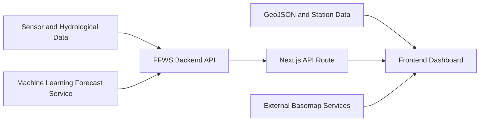

# Flood Forecasting Dashboard

A web-based dashboard for monitoring river conditions, water levels, rainfall, water quality, and flood risk in the Welang River Basin and Surabaya.

> Dashboard screenshot or GIF has not been added yet.

## Overview

Flood monitoring requires hydrological readings, forecast results, and geographic context to be reviewed together. This dashboard combines those inputs in an interactive map and station-detail pages.

The primary study area is the Welang River Basin in Pasuruan, East Java. The application also includes monitoring locations and river data for Surabaya. Users can inspect watershed boundaries, river networks, monitoring stations, simulated rainfall, water-level history, and short-term forecasts.

Welang readings and forecasts currently use deterministic simulation data. Surabaya pages request data through the frontend API route and show source freshness or connection failures when live readings are unavailable. The dashboard is intended for researchers and monitoring users. It is not presented as a validated operational warning system.

## Key Features

- Interactive watershed and river-network map
- Water-level monitoring with station status and history
- Five-hour flood-level forecasts
- Rainfall and water-quality visualization
- Searchable stations with detailed monitoring pages

Additional monitoring and analysis features are under active development.

## Dashboard Preview

Screenshot: not yet added.

GIF: not yet added.

Deployed URL: not yet published.

To run the dashboard locally, follow the instructions in [Local Development](#local-development).

## Study Area

The Welang River Basin covers monitoring locations along the Welang river system in Pasuruan. The bundled station dataset contains 15 locations, including Dhompo near the downstream section. Each station record includes WGS84 coordinates and a coordinate-confidence label.

The map also includes Surabaya monitoring locations, the city river network, and East Java regional context. Watershed and administrative boundaries come from Badan Informasi Geospasial (BIG). River features come from OpenStreetMap and are clipped to the relevant study boundary.

## Data Sources

| Data | Source | Format | Usage |
|---|---|---|---|
| Welang watershed boundary | BIG Atlas Wilayah Sungai, object 11622 | GeoJSON | Watershed map layer |
| Administrative boundaries | BIG Batas Wilayah Administrasi | GeoJSON | East Java regional context |
| Welang, Surabaya, and East Java rivers | OpenStreetMap contributors through Overpass API | GeoJSON | River-network visualization |
| Elevation and station sub-watersheds | DEMNAS from BIG, processed with WhiteboxTools | Raster input and GeoJSON output | Local drainage delineation |
| Welang monitoring stations | Project station dataset | JSON | Station locations and metadata |
| Welang water level, rainfall, and water quality | Deterministic frontend simulation | TypeScript data objects | Dashboard demonstration and interaction testing |
| Surabaya readings and forecasts | FFWS backend through `/api/surabaya` | JSON | Live or last-known monitoring when available |
| Basemaps | OpenStreetMap, BIG, Esri, and OpenTopoMap fallback | Raster map tiles | Geographic reference |

Source notes and processing metadata are stored with the datasets in `public/geo`.

## System Architecture



The frontend consumes REST data from the backend service. The backend integrates with the machine learning service for flood-level forecasting and analytics. Bundled GeoJSON and station files are loaded directly by the frontend.

## Technology Stack

- Next.js 16 and React 19
- TypeScript
- MapLibre GL for interactive maps
- Recharts for station history charts
- Standalone Next.js output for container deployment

## Local Development

Requirements:

- Node.js 22
- npm

Install dependencies and start the development server:

```powershell
npm ci
npm run dev
```

Open `http://localhost:3000`.

The pre-development script copies the required MapLibre worker files to `public/vendor`. This generated directory is excluded from version control.

## Production Build

```powershell
npm run build
```

The `Dockerfile` builds the standalone Next.js output and runs `node server.js` on port 3000.

## Verification

After a production build, check the dashboard at widths of 375, 768, and 1440 pixels. Verify keyboard navigation, station search and selection, panel closing with Escape, layer controls, detail-page navigation, reduced motion, and browser console errors.

## Related Repositories

- [FFWS Frontend](https://github.com/SomeRandomDolphin/ffws-frontend)
- [FFWS Backend](https://github.com/SomeRandomDolphin/ffws-backend)
- [FFWS Machine Learning](https://github.com/SomeRandomDolphin/ffws-ml)

## License

This project is for government and research use under the Flood Forecasting Warning System initiative.
